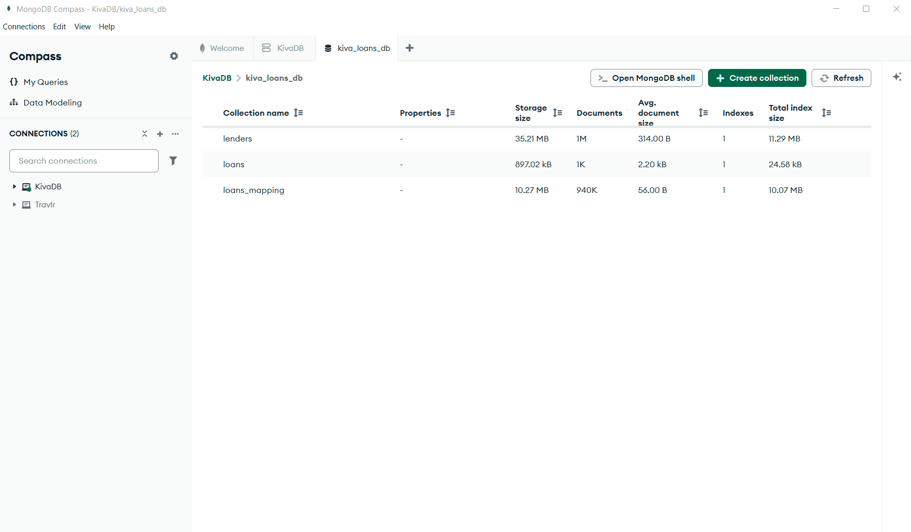
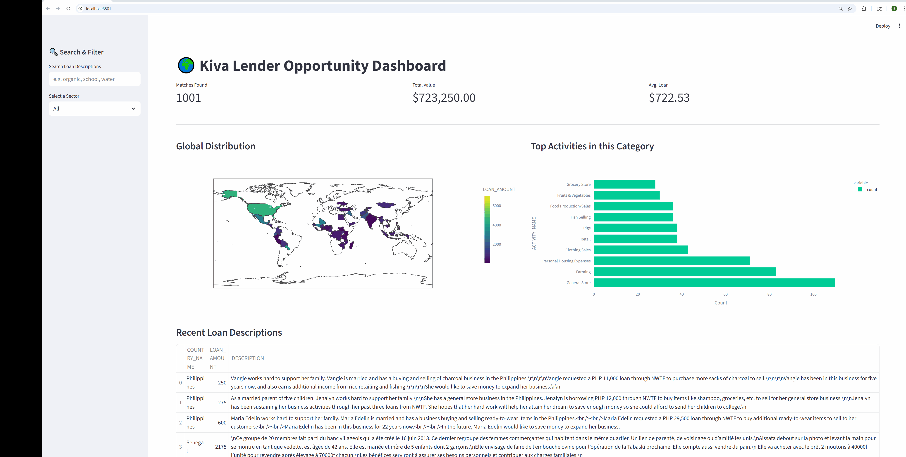
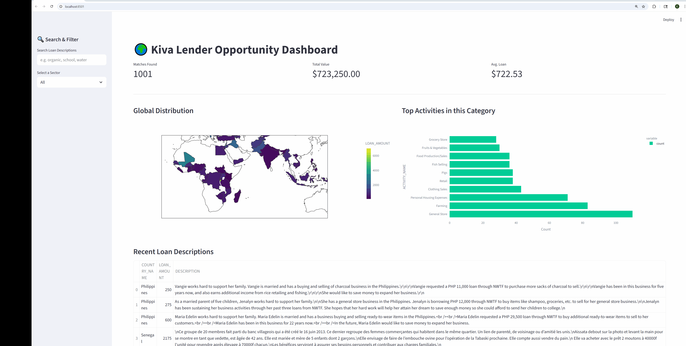

# Data_Web_Dashboard
Web dashboard to visualize loan and lender data from 3 .csv files# Kiva Data Visualization Dashboard

| MongoDB Structure | Dashboard Interface |
| :---: | :---: |
|  |  |

## Description
An interactive web dashboard built with Python to visualize lender and loan data from Kiva. The project was enhanced by migrating from a static CSV-based script to a dynamic MongoDB-integrated system, allowing for complex queries and real-time filtering.

## Enhancements
* **Databases**: Integrated a MongoDB backend for unstructured data storage and advanced filtering.
* **Visualization**: Developed a dynamic dashboard to represent data geographically and categorically using Streamlit.

## Dependencies
* **Language**: Python 3.x
* **Database**: MongoDB (using `pymongo`)
* **Data Handling**: `pandas`
* **Web Interface**: `streamlit` 

## Installation & Setup
1. Ensure you have a MongoDB instance running locally or via MongoDB Atlas.
2. Import your Kiva dataset into your MongoDB collection.
3. Update the connection string in the script to match your MongoDB credentials.
4. Run the following commands to install dependencies and launch the dashboard:
   ```bash
   pip install pymongo pandas streamlit
   streamlit run dashboard.py
